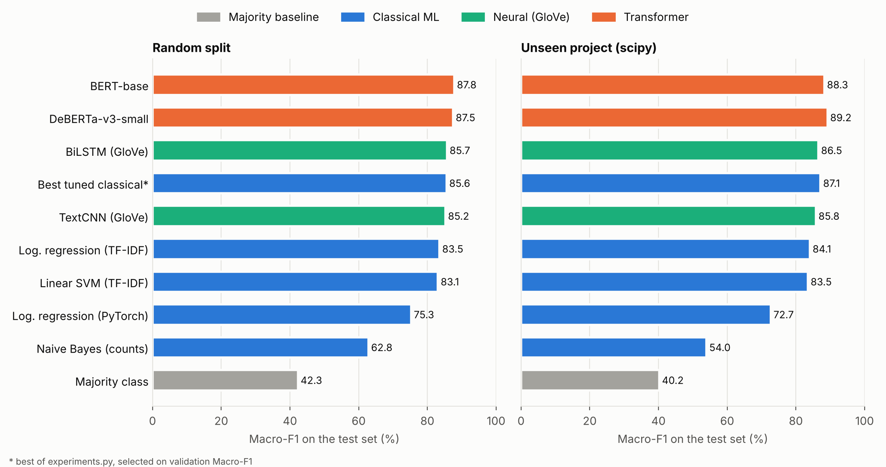
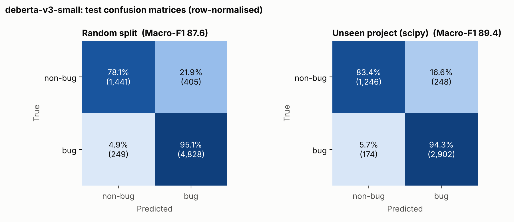
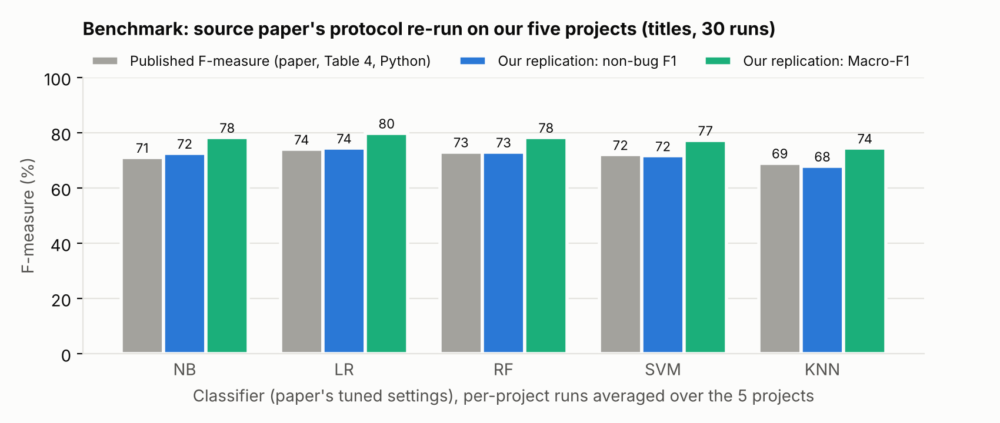
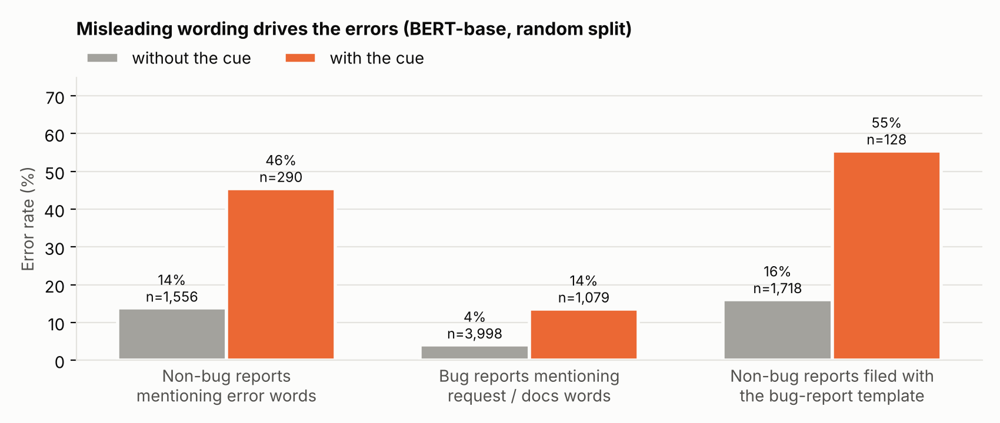
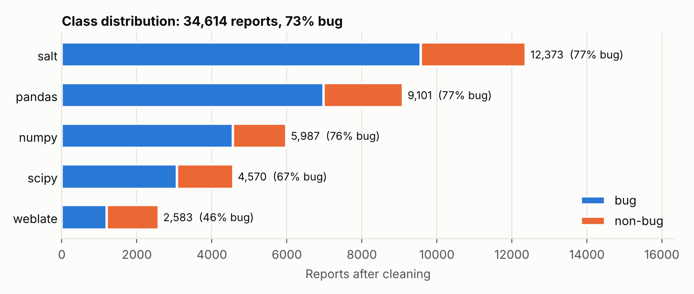

# tokens-project-1

**COE025 Natural Language Processing (İstinye University, Fall 2025-26), Project 1: Text Classification. Team Tokens.**

We classify GitHub issue reports as **bug** or **non-bug** (feature requests, documentation, questions and so on). Issue trackers of large open-source projects receive thousands of reports, and many of the reports filed as bugs are not bugs. An automatic first-pass label helps maintainers triage faster.

We compare a majority baseline, classical machine-learning models (Naive Bayes, linear SVM, logistic regression), neural models on GloVe embeddings (TextCNN, BiLSTM) and fine-tuned transformers (BERT, DeBERTa-v3) on the same cleaned data, the same fixed splits and the same metric function.

## Contents

- [Results](#results)
- [Additional experiments](#additional-experiments-feature-engineering-class-imbalance-ensemble)
- [Benchmark against the source paper](#benchmark-against-the-source-paper)
- [Error analysis](#error-analysis)
- [Dataset](#dataset)
- [Preprocessing](#preprocessing)
- [Evaluation setup](#evaluation-setup)
- [Methods](#methods)
- [How to reproduce](#how-to-reproduce)
- [Repository structure](#repository-structure)
- [Limitations](#limitations)
- [Team](#team)
- [License and attribution](#license-and-attribution)

## Results

Test-set results. The primary metric is **Macro-F1**, because the classes are imbalanced (about 73% bug). Each test set was evaluated once, with the configuration or checkpoint selected on the validation set.

**Random split** (all five projects mixed; test n = 6,923)

| Model | Features | Accuracy | Macro-F1 | Bug F1 |
|---|---|---:|---:|---:|
| Majority class | none | 73.34 | 42.31 | 84.62 |
| Naive Bayes (multinomial) | word counts | 63.83 | 62.84 | 68.92 |
| Linear SVM | TF-IDF, 1-2 grams | 87.46 | 83.09 | 91.69 |
| Logistic regression (PyTorch, SGD) | TF-IDF, 1-2 grams | 83.76 | 75.26 | 89.77 |
| Logistic regression (scikit-learn) | TF-IDF, 1-2 grams | 88.08 | 83.52 | 92.19 |
| Best tuned classical* (LR, threshold tuned) | words + chars + 13 features | 88.92 | 85.57 | 92.53 |
| TextCNN | GloVe 100d, first 256 tokens | 88.78 | 85.21 | 92.47 |
| BiLSTM | GloVe 100d, first 256 tokens | 89.02 | 85.68 | 92.60 |
| BERT `bert-base-uncased` | first 256 tokens | **90.52** | **87.81** | 93.56 |
| DeBERTa-v3 `deberta-v3-small` | first 256 tokens | 90.45 | 87.46 | **93.59** |

**Cross-project split** (train on numpy, pandas and salt; validate on weblate; test on scipy, n = 4,570)

| Model | Features | Accuracy | Macro-F1 | Bug F1 |
|---|---|---:|---:|---:|
| Majority class | none | 67.31 | 40.23 | 80.46 |
| Naive Bayes (multinomial) | word counts | 54.38 | 53.99 | 49.80 |
| Linear SVM | TF-IDF, 1-2 grams | 86.06 | 83.50 | 90.00 |
| Logistic regression (PyTorch, SGD) | TF-IDF, 1-2 grams | 80.04 | 72.69 | 86.86 |
| Logistic regression (scikit-learn) | TF-IDF, 1-2 grams | 86.89 | 84.07 | 90.77 |
| Best tuned classical* (LR + SVM + NB ensemble) | words + chars + 13 features | 88.91 | 87.14 | 91.91 |
| TextCNN | GloVe 100d, first 256 tokens | 88.01 | 85.78 | 91.41 |
| BiLSTM | GloVe 100d, first 256 tokens | 88.47 | 86.54 | 91.63 |
| BERT `bert-base-uncased` | first 256 tokens | 90.02 | 88.26 | 92.81 |
| DeBERTa-v3 `deberta-v3-small` | first 256 tokens | **90.63** | **89.19** | **93.14** |

All values are percentages. \* The best of the configurations in [Additional experiments](#additional-experiments-feature-engineering-class-imbalance-ensemble), selected on validation Macro-F1. Sources: `results/benchmark.csv`, `results/experiments.csv`, `results/neural_cnn_benchmark.csv`, `results/neural_bilstm_benchmark.csv`, `results/bert_benchmark.csv`, `results/transformer_benchmark.csv`. The DeBERTa numbers come from the re-run in `colab_runs.ipynb`, which also saved its test predictions; the first run had 87.58 / 89.37 Macro-F1, so GPU run-to-run noise is about 0.1 to 0.2 points. Per-class precision, recall and confusion matrices are in the matching `*metrics.json` files.

**Main findings**

- Fine-tuned transformers beat the baseline classical models (TF-IDF logistic regression) by about 4 Macro-F1 points on the random split and 4 to 5 points on the cross-project split. Feature engineering and threshold tuning close about half of that gap.
- DeBERTa-v3-small (6 layers) matches BERT-base (12 layers) on the random split and is about 0.9 Macro-F1 points better on the unseen project.
- The Week 3 neural models with GloVe embeddings (TextCNN, BiLSTM) reach 85 to 87 Macro-F1: about 2 points better than the baseline classical models, on par with the tuned classical models, and 2 to 3.5 points below the fine-tuned transformers. They train in 1 to 1.5 minutes per scenario on a T4 GPU, against 13 to 14 minutes for DeBERTa.
- The transformers keep about 90% accuracy on a project they never saw in training (scipy), which suggests they learn general bug-report language rather than only project-specific vocabulary.
- Both transformers are weaker on the minority class (non-bug): non-bug reports are labelled as bugs more often than the reverse.
- Naive Bayes with raw word counts has lower accuracy than the majority baseline but much higher Macro-F1: it predicts the non-bug class far more often, which helps the minority class and hurts overall accuracy.
- These are single runs with one seed, so differences of a few tenths of a point should not be over-interpreted.





**Per-class precision and recall of the transformers** (%, test set)

| Model | Scenario | Non-bug precision | Non-bug recall | Bug precision | Bug recall |
|---|---|---:|---:|---:|---:|
| BERT-base | random | 82.9 | 81.2 | 93.2 | 93.9 |
| BERT-base | unseen project | 89.8 | 78.4 | 90.1 | 95.7 |
| DeBERTa-v3-small | random | 85.0 | 78.0 | 92.2 | 95.0 |
| DeBERTa-v3-small | unseen project | 87.9 | 82.7 | 91.8 | 94.5 |

Non-bug recall is the transformers' weak spot: about one non-bug report in five is labelled as a bug. It is lower still for the TF-IDF baselines (67 to 71% for logistic regression and SVM); only Naive Bayes on raw counts reaches 89 to 97%, by calling most reports non-bug. Precision and recall of every model are in the matching `*metrics.json` files.

## Additional experiments: feature engineering, class imbalance, ensemble

`experiments.py` explores the classical side further. Every hyperparameter (alpha, C, the decision threshold, the ensemble threshold) is chosen on the validation set; the test set is scored once. Full grids: `results/experiments_metrics.json`.

| Group | Model and features | Random: Macro-F1 | Unseen project: Macro-F1 |
|---|---|---:|---:|
| Naive Bayes | word counts, 5k words, alpha tuned | 63.1 | 54.8 |
| | **TF-IDF**, 50k word 1-2 grams | **80.5** | **83.3** |
| | Complement NB, TF-IDF | 77.1 | 78.5 |
| Features (logistic regression) | TF-IDF 5k word 1-2 grams (as in `benchmark.py`, C tuned) | 83.5 | 84.0 |
| | TF-IDF 50k word 1-2 grams, sublinear tf | 84.6 | 85.9 |
| | character 2-5 grams | 84.6 | 85.6 |
| | words + characters | 84.8 | 85.6 |
| | words + characters + 13 hand-crafted features | 85.1 | 86.5 |
| Class imbalance | same, class-weighted loss | 84.9 | 86.4 |
| | same, decision threshold tuned on validation | **85.6** | 87.0 |
| | linear SVM, same features | 85.3 | 86.8 |
| | linear SVM, class-weighted | 84.8 | 86.5 |
| Ensemble | class-weighted LR + class-weighted SVM + Complement NB | 83.8 | **87.1** |

The hand-crafted features are: length in characters and words, share of digits and symbols, counts of traceback, error, request, "expected / actual", version-number, URL and question-mark patterns, and the rates of error and request words.

- **Naive Bayes was held back by its features, not by the model.** With TF-IDF weights and a larger vocabulary it rises from 63.1 to 80.5 Macro-F1 (random split). With raw counts it predicts non-bug for 57% of the test reports (the true share is 27%), probably because long reports with many words dominate the count statistics.
- **Feature engineering adds about 2 points** to logistic regression on both splits: a larger vocabulary helps most, character n-grams and the hand-crafted features add a little more.
- **Tuning the decision threshold** on validation (0.60 instead of 0.50) is the best single step against the class imbalance; class weights alone change little.
- **The ensemble** only helps on the unseen project; on the random split the weaker Naive Bayes member pulls it down.
- The best classical models close about half of the gap to the transformers, at a fraction of the cost (minutes on a CPU instead of a GPU).
- The model selected on validation (`classical_predictions_<scenario>.csv`) is used in the error analysis below.

## Benchmark against the source paper

The dataset comes from Andrade et al. ([arXiv 2503.00660](https://arxiv.org/abs/2503.00660)). Their Table 4 reports, for exactly our five Python projects, an average F-measure of **NB 0.71, LR 0.74, RF 0.73, SVM 0.72, KNN 0.69**.

Their protocol differs from ours, so these numbers cannot be put next to our tables directly. They use issue titles only, TF-IDF reduced to 250 features with a chi-squared test, a random 70 / 30 split repeated 30 times, a training set balanced by undersampling, and their tuned classifier settings. `paper_protocol.py` re-implements this protocol on our raw data. The paper does not say which F1 it reports (bug class, macro or weighted), so the script reports all of them. Full results: `results/paper_protocol.csv`.

**Their protocol on our data, one experiment per project, averaged over the five projects (30 runs each)**

| Classifier | Paper F-measure | Our non-bug F1 | Our bug F1 | Our Macro-F1 |
|---|---:|---:|---:|---:|
| Naive Bayes | 0.71 | 0.72 | 0.84 | 0.78 |
| Logistic regression | **0.74** | **0.74** | **0.85** | **0.80** |
| Random forest | 0.73 | 0.73 | 0.84 | 0.78 |
| SVM | 0.72 | 0.72 | 0.83 | 0.77 |
| KNN | 0.69 | 0.68 | 0.81 | 0.74 |



- **We reproduce the paper.** The classifier ranking is the same (logistic regression best, KNN worst), and the published values match our non-bug-class F1 within 0.015 for all five classifiers. This suggests, though the paper does not say so, that its F-measure is the F1 of the non-bug class.
- **Per project**, logistic regression on titles reaches a Macro-F1 of 0.71 on weblate and 0.73 on salt, up to 0.87 on numpy.
- **Adding the description** (same protocol, all projects pooled) helps SVM (Macro-F1 0.78 → 0.81), leaves logistic regression and random forest at about 0.80, and hurts Naive Bayes (0.80 → 0.76) and KNN (0.76 → 0.73), which degrade on long, noisy texts with only 250 features.
- **Our pipeline goes clearly beyond the published baseline.** On a single held-out test set without undersampling, the tuned classical models reach a Macro-F1 of 0.86 to 0.87 and the fine-tuned transformers 0.88 to 0.89, against 0.80 for the paper's best configuration on the same projects. The test sets differ (ours is one fixed split, theirs 30 random splits), so this comparison is indicative rather than exact.

## Error analysis

`error_analysis.py` joins the saved test predictions with the data and measures where the models fail; `results/error_analysis.json` holds every number below and `results/error_examples.csv` a fixed random sample of 50 misclassified reports per scenario for manual reading. The numbers below are for **BERT-base**; `error_analysis.json` has the same breakdown for DeBERTa, TextCNN, BiLSTM and the best classical model, and the patterns are the same (DeBERTa: 9.5% errors on the random split, 22.0% of non-bugs vs 5.0% of bugs misclassified).

**Where the errors are (random split, 656 errors out of 6,923 = 9.5%)**

- **The minority class is the hard one.** 18.8% of non-bug reports are wrongly called bugs, but only 6.1% of bugs are called non-bugs (cross-project: 21.6% vs 4.3%).
- **Weblate is the weakest project** (16.7% errors vs 7.9 to 9.5% for the others). It is the only project where non-bugs are the majority (46% bug, against 67 to 77% elsewhere), so a model trained mostly on bug-heavy projects leans the wrong way there.
- **Length is not the problem.** Errors fall as reports get longer: 10.8% under 50 words, 6.1% above 400 words. Truncating to 256 tokens therefore does not cost much.

**Misleading wording drives the errors**



| Group (random split) | Error rate with the cue | without it |
|---|---:|---:|
| Non-bug reports that mention *error, exception, fail, crash, traceback* | **45.5%** (n = 290) | 13.8% |
| Non-bug reports filed with the bug-report template (*steps to reproduce, expected behaviour*) | **55.5%** (n = 128) | 16.1% |
| Bug reports that mention *add, support, feature, docs, deprecate* | **13.6%** (n = 1,079) | 4.1% |

The model has learned, sensibly, that failure vocabulary means "bug". Its mistakes are the reports whose wording points the other way from their label.

**The errors are shared across model families.** 466 of BERT's 656 errors (71%) are also made by the best classical model (cross-project 271 of 456, 59%), and 522 of DeBERTa's 661 errors (79%) are also made by BERT. The hard cases are hard for every approach, which points to the data rather than to one model's weakness.

**Manual review of 50 random BERT errors** (`results/error_examples.csv`, random split)

- *Non-bugs called bugs (25):* about 10 describe something that does not work (a missing library on Windows, a wrong default path, a certificate that expires) and read like defects to a human as well; these are borderline or arguably mislabelled. About 6 are pull requests or maintenance changes, 4 are missing features phrased as failures ("X does not support Y", "doesn't handle"), 2 are performance complaints, the rest usage questions.
- *Bugs called non-bugs (25):* about 7 are pull requests whose text describes the change ("allow ...", "implement ...") rather than the defect, about 9 use request or documentation wording ("would it be a good idea", "documentation improvement", one even uses the feature-request template), 3 are questions, and about 6 are genuine bugs described without any failure words (an installer that "sits forever", a download that omits plural forms).

**Takeaways.** Most remaining errors sit on the fuzzy border between "bug", "missing feature" and "improvement", where the labels themselves are inconsistent; more model capacity will not fix those. Practical next steps would be using the issue's own metadata (template choice, whether it is a pull request) as features, and calibrating the decision threshold per project for trackers like weblate with a different class balance.

## Dataset

| | |
|---|---|
| Source | Andrade, Teixeira, Laranjeiro and Vieira, *An Empirical Study on the Classification of Bug Reports Using Machine Learning*, supplementary material v1.0.0 ([Zenodo 7377402](https://doi.org/10.5281/zenodo.7377402), [paper](https://arxiv.org/abs/2503.00660)) |
| License | CC BY 4.0 (see `data/LICENSE`) |
| Projects used | numpy, pandas, salt, scipy, weblate (5 Python projects from the original archive) |
| Fields | `summary` (issue title), `description` (issue body), `type` (`bug` / `non-bug`) |
| Raw records | 34,949 (25,564 bug, 9,385 non-bug) |
| After cleaning | 34,614 |

Records per project (raw): numpy 6,079, pandas 9,304, salt 12,397, scipy 4,586, weblate 2,583.



The labels were assigned by the source authors and issue-tracker participants, not by this project.

## Preprocessing

`preprocess.py` turns the five raw CSV files into `data/cleaned.jsonl`. It also writes `results/data_audit.json`, which records source hashes, every count below and the split sizes.

1. **Input text** = issue title + newline + issue body.
2. **Title prefixes removed** (`[BUG]`, `ENH:`, `DOC:`, `MAINT:` and similar), because they would reveal the label directly. Removed in 9,691 titles.
3. **Markup removed:** HTML comments (often issue templates), HTML tags, code-fence markers (the code itself is kept), markdown heading markers, and template headings such as "Bug report" / "Feature request". URLs are replaced with the token `URL`. HTML entities are decoded.
4. **Normalisation:** Unicode NFKC, whitespace collapsed, lower-cased, texts longer than 20,000 characters truncated (92 texts).
5. **Filtering:** 2 empty texts removed, 33 exact duplicates removed, and 300 rows removed because the same text appeared with conflicting labels.

Removing duplicates before splitting guarantees that no identical text appears in both training and test data.

## Evaluation setup

Two fixed scenarios, both created by `preprocess.py` with seed 42 and stored as columns in `cleaned.jsonl`:

| Scenario | Train | Validation | Test | How |
|---|---:|---:|---:|---|
| `random` | 24,229 | 3,462 | 6,923 | Stratified 70 / 10 / 20 split over all projects |
| `cross_project` | 27,461 (numpy, pandas, salt) | 2,583 (weblate) | 4,570 (scipy) | Whole projects held out, to test generalisation to an unseen project |

- **Model selection** uses only the validation set (epoch choice for the neural models). The test set is used once.
- **Metrics:** accuracy, Macro-F1 (primary), bug-class F1, per-class precision / recall / F1 and the confusion matrix, all computed by the shared `metrics()` function in `benchmark.py`, so every model is scored the same way.
- **Majority baseline** shows what accuracy alone would suggest on imbalanced data: 73% accuracy but only 42% Macro-F1.

## Methods

| Method | Script | Details |
|---|---|---|
| Majority class | `benchmark.py` | Always predicts the most frequent class (bug) |
| Naive Bayes | `benchmark.py` | Multinomial NB, α = 1.0, word counts (5,000 most frequent words, min_df = 2) |
| Linear SVM | `benchmark.py` | `LinearSVC`, C = 1.0, TF-IDF of unigrams and bigrams (5,000 features, min_df = 2) |
| Logistic regression (scikit-learn) | `benchmark.py` | C = 1.0, same TF-IDF features |
| Logistic regression (PyTorch) | `benchmark.py` | One linear layer with BCE-with-logits loss and SGD (lr 0.1, batch 256, up to 100 epochs, best epoch chosen on validation Macro-F1); the Week 2 formulation implemented by hand |
| BERT | `train_bert.py` | `bert-base-uncased` (12 layers, 110M parameters) fine-tuned with a 2-class head |
| DeBERTa-v3 | `train_transformer.py` | `microsoft/deberta-v3-small` (6 layers) fine-tuned with a 2-class head |
| NB variants, feature engineering, imbalance handling, ensemble | `experiments.py` | See [Additional experiments](#additional-experiments-feature-engineering-class-imbalance-ensemble) |
| TextCNN | `train_neural.py --model cnn` | Kim (2014): GloVe 100d embeddings (fine-tuned), filters of width 3 / 4 / 5 (100 each), max-pooling, dropout 0.5; Adam lr 1e-3, batch 64, 5 epochs, best epoch on validation |
| BiLSTM | `train_neural.py --model bilstm` | GloVe 100d, one bidirectional LSTM layer (128 units per direction), max + mean pooling, dropout 0.5; same training setup |
| Paper protocol | `paper_protocol.py` | See [Benchmark against the source paper](#benchmark-against-the-source-paper) |

TextCNN and BiLSTM were trained on a Colab T4 GPU with `colab_runs.ipynb`. GloVe covers only about 36% of the 50,000-word vocabulary (18,083 words on the random split): code identifiers, function names and project terms are missing and start from random vectors that are learned during training.

Both transformer scripts share the same training setup: first 256 tokens per report with padding per batch, AdamW (lr 2e-5, weight decay 0.01), linear warm-up over 6% of the steps, batch size 16, 2 epochs, gradient clipping at 1.0, mixed precision, and checkpoint selection by validation Macro-F1.

## How to reproduce

### 1. Data, classical models and analyses (CPU)

```bash
git clone https://github.com/zehraoz36/tokens-project-1.git
cd tokens-project-1
python -m venv .venv && source .venv/bin/activate   # Windows: .venv\Scripts\activate
pip install -r requirements.txt

python preprocess.py   # rebuilds data/cleaned.jsonl and results/data_audit.json
python benchmark.py    # writes results/benchmark.csv and results/metrics.json

python experiments.py      # feature engineering / imbalance / ensemble (~40-60 min on 2 cores)
python -m nltk.downloader wordnet omw-1.4   # once, for paper_protocol.py
python paper_protocol.py   # benchmark against the source paper (~35 min)
python error_analysis.py   # error analysis of all saved predictions (seconds)
python make_figures.py     # results/figures/*.png (seconds)
python predict.py          # demo; first run trains the demo model (~1 min)
```

`predict.py "your issue title"` classifies one issue and lists the words that pushed the decision; `--interactive` asks for titles in a loop; `--model models/deberta` uses the fine-tuned DeBERTa saved by the Colab notebook.

The five raw CSV files are already in `data/raw/`, so `preprocess.py` does not download anything. To start from the official archive instead, pass `--archive path/to/Datasets.zip`; the script checks the archive's MD5 before using it. Without the raw files and without `--archive`, the script downloads the 207 MB archive into `.download-cache/`.

### 2. Transformer and neural models (GPU, Google Colab)

The easiest way is to open **`colab_runs.ipynb`** in Colab (File > Upload notebook, or open it from GitHub) and run it top to bottom: it re-runs DeBERTa with prediction export and a saved model for the demo, trains TextCNN and BiLSTM, refreshes the error analysis and figures, and downloads the new `results/`.

To run the scripts by hand, choose **Runtime > Change runtime type > T4 GPU**, then:

```bash
!git clone https://github.com/zehraoz36/tokens-project-1.git
%cd tokens-project-1
!pip uninstall -y torchvision          # Colab's preinstalled torchvision breaks the transformers import
!pip install transformers==5.18.0

!python train_bert.py --limit 200 --epochs 1   # quick check (~1 min), saves nothing
!python train_bert.py                          # BERT, both scenarios (~25 min on a T4)
!python train_transformer.py --save-model models/deberta   # DeBERTa-v3-small (~27 min on a T4)
!python train_neural.py --model cnn            # TextCNN + GloVe (downloads GloVe, ~820 MB)
!python train_neural.py --model bilstm         # BiLSTM + GloVe
```

Colab's own CUDA build of PyTorch is used, so do not install the CPU `torch` pinned in `requirements.txt` there. Our runs used Python 3.13, torch 2.11.0+cu130 and transformers 5.18.0 on a Tesla T4. Useful options: `--epochs`, `--max-length`, `--batch-size`, `--lr`, `--no-amp` (disable mixed precision if the loss becomes NaN) and `--model` (any Hugging Face sequence-classification checkpoint).

Download the files written to `results/` before the Colab session ends.

## Repository structure

```
├── preprocess.py              # raw CSV -> cleaned.jsonl + splits + data audit
├── benchmark.py               # majority, Naive Bayes, SVM, logistic regression; shared metrics()
├── train_bert.py              # BERT fine-tuning (also exports test predictions)
├── train_transformer.py       # DeBERTa-v3 fine-tuning (exports test predictions, --save-model)
├── train_neural.py            # TextCNN / BiLSTM with GloVe
├── experiments.py             # NB variants, feature engineering, imbalance, ensemble
├── paper_protocol.py          # the source paper's protocol, for the benchmark comparison
├── error_analysis.py          # error rates by class, project, length, wording; model agreement
├── make_figures.py            # results/figures/*.png
├── predict.py                 # demo: classify a new issue
├── colab_runs.ipynb           # GPU runs on Google Colab
├── requirements.txt
├── data/
│   ├── raw/                   # five original CSV files (CC BY 4.0)
│   ├── cleaned.jsonl          # one record per issue: record_id, project, label, text,
│   │                          # text_sha256, random_split, cross_project_split
│   └── LICENSE                # dataset license and attribution
├── results/
│   ├── data_audit.json        # source hashes, cleaning counts, split sizes
│   ├── benchmark.csv          # classical models, summary
│   ├── metrics.json           # classical models, full metrics
│   ├── bert_benchmark.csv / bert_metrics.json
│   ├── bert_predictions_{random,cross_project}.csv   # text_sha256, true_label, predicted_label
│   ├── transformer_benchmark.csv / transformer_metrics.json
│   ├── transformer_predictions_{random,cross_project}.csv
│   ├── neural_{cnn,bilstm}_benchmark.csv / _metrics.json / _predictions_*.csv
│   ├── experiments.csv / experiments_metrics.json
│   ├── classical_predictions_{random,cross_project}.csv   # record_id, true, predicted
│   ├── paper_protocol.csv / paper_protocol.json
│   ├── error_analysis.json / error_examples.csv
│   └── figures/               # PNG figures used in the README and the slides
└── contributions/             # one file per team member
```

## Limitations

- One training seed per model, so small differences are within run-to-run noise.
- Transformer inputs are truncated to 256 tokens; long reports lose their tail.
- The cross-project test covers one project (scipy) only.
- Only binary labels (bug / non-bug) are used.
- The paper replication follows the published description; details it does not state (stop-word list, F1 definition, exact tokenisation) had to be chosen by us.
- Many remaining errors are borderline or inconsistently labelled reports (see the error analysis), which caps what any model can reach on this data.

## Team

| Name | Student ID | GitHub |
|---|---|---|
| Begüm Ziyade | 220901561 | |
| Yunus Emre Demirel | 210911053 | |
| Tuana Harmankaya | 2309111029 | [@tia88na](https://github.com/tia88na) |
| Ece Mina Örenler | 220901539 | |
| Zehra Özcan | 2309011051 | [@zehraoz36](https://github.com/zehraoz36) |

Individual contributions are described in `contributions/`.

## License and attribution

- **Code:** MIT License (see `LICENSE`).
- **Data:** CC BY 4.0. Renato Andrade, Cesar Teixeira, Nuno Laranjeiro and Marco Vieira, *An Empirical Study on the Classification of Bug Reports Using Machine Learning*, supplementary material v1.0.0, https://doi.org/10.5281/zenodo.7377402. Five projects were selected and cleaned as described above; see `data/LICENSE`. No endorsement by the original authors is implied.
